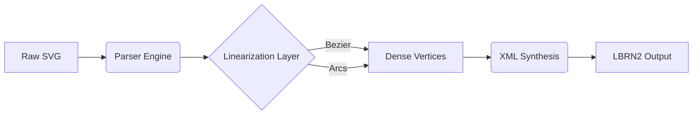

<div align="center">
  <h1>🔥 LumenBurn Engine</h1>
  <p><strong>A high-precision SVG to LightBurn (.lbrn2) conversion pipeline</strong></p>

  [](https://opensource.org/licenses/MIT)
  [](#)
  [](#)
</div>

---

## 🎯 Overview

LumenBurn is an advanced vector processing engine built to seamlessly convert raw SVG paths into the native LightBurn `.lbrn2` XML schema (v1.4.00+). Designed for makers, laser operators, and automation workflows, LumenBurn emphasizes dimensional accuracy, hardware compatibility, and programmatic cut settings.

## 🚀 Features

- **Geometric High-Density Linearization**: Automatically samples complex curves (Beziers, Arcs) into dense vertex arrays, minimizing DSP controller stutter.
- **Layer & Color Mapping**: Dynamically binds SVG stroke colors to LightBurn `CutIndex` parameters.
- **Millimeter Accurate**: Strictly enforces metric scaling with origin (0,0) normalization.
- **API & CLI Included**: Run it headlessly via the Node.js CLI or spin up the Express API.

## 🛠️ System Architecture



## 💻 Usage

### CLI Mode

```bash
node lumenburn/cli.js <input.svg> <output.lbrn2>
```

### API Interface
Start the backend server:
```bash
npm start
```
Navigate to `http://localhost:3000/static/lumenburn.html` for the interactive drag-and-drop web UI.

---
*Built with ❤️ for the laser cutting community.*