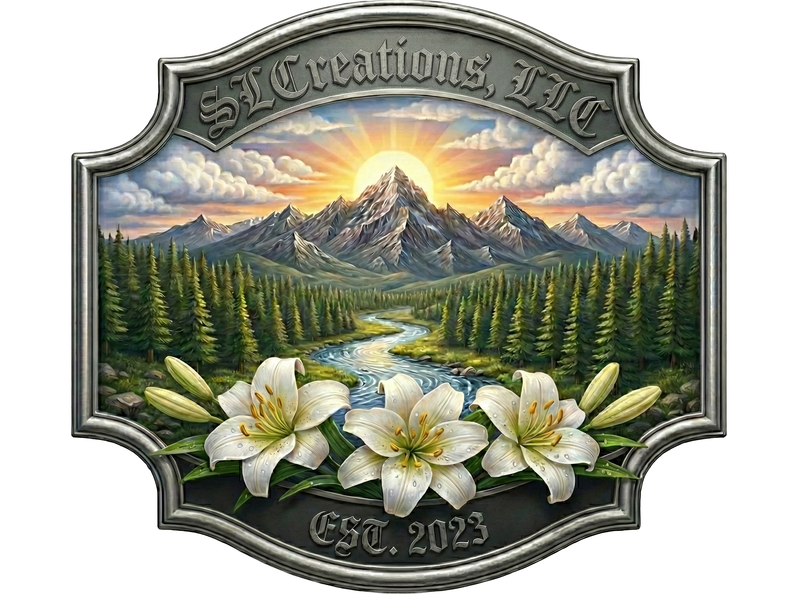
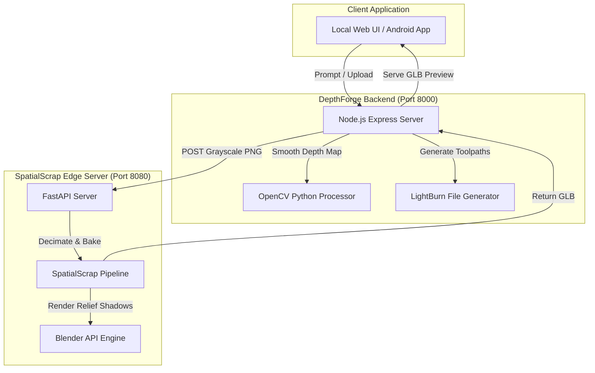

<div align="center">
  
  <h1>DepthForge</h1>
  <p><em>A mixed web and mobile workspace for depth-map generation, spatial mesh compilation, and CNC laser workflow.</em></p>

  
  
  
</div>

<hr />

## 🚀 Executive Summary: SpatialScrap

**Dynamic Material Nesting for Sustainable Fabrication**

SpatialScrap is a production-grade material nesting utility engineered to bridge the critical gap between digital asset pipelines and physical workshop logistics. In modern fabrication, the inability to visualize digital designs within the jagged, irregular "negative space" of reclaimed material results in significant waste, lost time, and increased project liability.

Built natively for Android XR using the Jetpack SceneCore pipeline, SpatialScrap empowers fabricators to project exact-scale, high-fidelity 3D toolpaths directly onto physical scrap in real time. By leveraging ARCore’s advanced perception layer, users can dynamically scale, rotate, and nest digital assets into un-carved boundaries, hands-free.

Our commitment to sustainable, hardware-optimized architecture ensures that SpatialScrap is not restricted to high-spec workstations; it is a resource-efficient utility designed for workshop-standard compatibility. By delivering professional-grade performance across diverse computing environments, we are democratizing industrial-grade XR workflows, proving that high-tech spatial computing can—and should—be accessible to every fabricator, regardless of their hardware footprint.

---

## 🌟 Overview

DepthForge is built on a **resource-efficient architecture** designed for **Optimized Industrial Efficiency**. The main runtime operates as a local **Node.js + Express Edge Server** that coordinates a **Hardware-Agnostic Processing** pipeline across cloud, local APIs, and physical workshop machinery:

* **Cloud AI Generation (Gemini & Imagen):** Offloads prompt expansion and initial 3D height-map generation to centralized cloud APIs, minimizing local compute requirements.
* **Hardware-Optimized Edge Processing (OpenCV & Python):** Runs bilateral filtering, inpainting, and normalization locally to remove stair-stepping artifacts efficiently on standard workshop computers.
* **Spatial 3D Preview (SpatialScrap API):** Transmits 16-bit depth maps to a local FastAPI-driven SpatialScrap service to compile, decimate, and export high-quality, low-latency `.glb` meshes for spatial computing environments.
* **Workshop-Standard Compatibility:** Generates native **LightBurn (.lbrn2)** project files to guarantee broad compatibility and direct CNC laser integration across different hardware stacks.
* **Local Web UI & API Hub:** Renders the web interface and exposes API endpoints for student submission queues and hardware controls.

---

## 🏗️ System Architecture



---

## 📋 Table of Contents
- [Repository Layout](#-repository-layout)
- [Requirements](#-requirements)
- [Setup & Installation](#-setup--installation)
- [Run the Web App](#-run-the-web-app)
- [Web API & Features](#-web-api--features)
- [Python Helpers](#-python-helpers)
- [Android App](#-android-app)
- [Audit & Dev Notes](#-audit--dev-notes)

---

## 🏗️ Repository Layout

```text
📦 DepthForge
 ┣ 📜 server.js         # Primary Express application and API surface
 ┣ 📜 processor.py      # Image smoothing and mesh placeholder helpers
 ┣ 📜 tune_depth.py     # Interactive OpenCV depth-map tuner
 ┣ 📂 templates/        # HTML pages for the web UI
 ┣ 📂 static/           # Uploaded and generated assets (images, GLBs, etc.)
 ┣ 📂 android_app/      # Native Android Kotlin + Jetpack Compose application
 ┣ 📂 blender_plugin/   # Blender-side helper code and notes
 ┗ 📂 lib/              # LightBurn file generator tools
```

---

## 💻 Requirements

- **Node.js:** 18 or newer
- **npm:** Node Package Manager
- **Python:** 3.10+ *(for smoothing or mesh conversion)*
- **API Key:** A Google Gemini API key mapped in `GEMINI_API_KEY`
- **SpatialScrap Edge Server:** Running locally (default port `8080`) to process 3D previews.
- **LightBurn:** Installed locally to open exported `.lbrn2` files.

---

## 🛠️ Setup & Installation

**1. Install the Node dependencies:**
```bash
npm install
```

**2. Configure Environment Variables:**
Create a `.env` file in the repo root:
```env
GEMINI_API_KEY=your_api_key_here
PORT=8000
```

**3. Install Python Dependencies:**
```bash
pip install opencv-python numpy
```

---

## 🚀 Run the Web App

**1. Fire up the SpatialScrap Edge Server** (runs on port `8080`):
```bash
# In the SpatialScrap directory
.venv_edge\Scripts\spatial-scrap --server
```

**2. Start the DepthForge Server** (runs on port `8000`):
```bash
# In the DepthForge directory
npm start
```

Open `http://localhost:8000` in your browser.

### Deploy to Google Cloud Run
A `Dockerfile` is provided to deploy the Node.js + Python stack to Google Cloud Run.
```bash
gcloud run deploy depthforge \
  --source . \
  --region us-central1 \
  --allow-unauthenticated \
  --memory 2Gi \
  --set-env-vars="GEMINI_API_KEY=YOUR_API_KEY_HERE"
```

---

## 🌐 Web API & Features

| Method | Endpoint | Description |
| :--- | :--- | :--- |
| `GET` | `/` | 🏠 Landing page |
| `GET` | `/menu` | 📋 Main menu page |
| `GET` | `/depth-map` | 🗺️ Depth-map generation page |
| `GET` | `/submit` | 📤 User submission page |
| `GET` | `/admin` | 🛡️ Admin dashboard |
| `POST` | `/api/generate` | ✨ Improves a text prompt & generates an image via Imagen 4. |
| `POST` | `/api/postprocess`| 🧽 Smooths generated height maps locally using bilateral filtering. |
| `POST` | `/api/preview3d` | 🧊 Compiles the 16-bit depth map into a real decimated GLB using SpatialScrap. |
| `POST` | `/api/laser/lightburn`| 🎯 Generates a LightBurn `.lbrn2` project file from a depth map. |
| `POST` | `/api/chat` | 💬 Gemini-backed assistant chat endpoint. |

---

## 🐍 Python Helpers

The Node server calls `processor.py` for image tasks:
- **`smooth`** - Applies bilateral and Gaussian smoothing to a depth map.
- **`mesh`** - Writes a fallback placeholder file (used if the SpatialScrap server is offline).

**Interactive Tuner Script:**
You can run the tuner script manually against a depth image to adjust settings:
```bash
python tune_depth.py path\to\image.png
```

---

## 📱 Android App

`android_app/` is a native Android application built using **Kotlin & Jetpack Compose**. It perfectly mirrors the features of the web UI (Mailing list landing modal, The Forge with full post-processing pipeline visualization, Support AI chat assistant, and the Admin Queue/Leads dashboard) and supports a direct laser launch workflow with live WebSocket status monitoring.

---

## 📝 Audit & Dev Notes

* 🧊 **3D Preview Upgrade:** 3D GLB mesh generation is now fully implemented! DepthForge transmits generated 16-bit depth maps directly to SpatialScrap's local FastAPI endpoint. It yields actual, low-latency spatial models ready for AR/VR device previews.
* 🛡️ **Admin Tools:** The Admin dashboard allows tracking leads and managing the queue of LightBurn files submitted by students. Files can be opened directly into LightBurn from the browser!
* 🗑️ **STL Export:** STL export functionality has been formally removed from the application as the focus shifted fully to the LightBurn laser workflow.

---

<div align="center">
  <i>Developed for SLCreations, LLC</i><br>
  Available under the <a href="LICENSE">MIT License</a>.
</div>